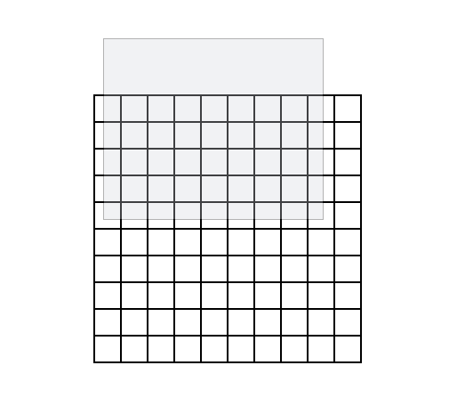
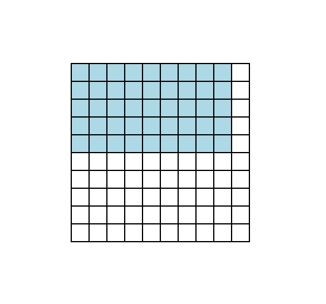

# Selectable Grid

Frontendeval machine coding challenge [here](https://frontendeval.com/questions/selectable-grid)

## Table of contents

- Table of contents
  - Screenshoot
  - Live Link
  - Built with
- Installation

### Screenshot

### Virtual box display

### Selected box intercepted by virtual box

### Links

- Live Site URL: [Click here](https://selectable-grid-eight.vercel.app/)

### Built with

- Typescript
- Tailwind.css
- React.js

## Installation

- Clone repo into your drive
- cd into the repo
- run npm install on the terminal
- after installation of packages, then npm run dev
